# Determining the best predictors for stock price using LASSO regression and creating a recommendation model for Stock Investment based on ARIMA forecasting
# Authors

**Ameya Abhay Munagekar, Pushpal Jagdale, Priyesh Jain, Pranav Kulkarni**

# YouTube Video Link
https://www.youtube.com/watch?v=LKxjXHYfrOE&

# Objective
The aim of this project is to build an advisory system for a Stock Trader or an Investor. This model will help predict the stock prices and recommend Buy and Hold strategy based on their desired investment.

# Introduction
Forecasting the stock prices remains one of the biggest issues faced by many investors. As the name suggests, the first rule of forecasting is that it cannot be fully accurate. To get closer to the actual stock price, a detailed study of the factors potentially affecting the market is done. Various hypotheses based on these studies have given rise to some algorithms and mathematical models, that is used in this documentation to predict the future stock prices.

Oil being one of the most important commodities on the market, a comprehensive comparison of Current Oil Prices, Historical Stock Price data and the Current Stock Price is done in this project. This comparison reveals the suitable factor for forecasting the stock prices which forms the basis of the advisory system. 

# References
* ARIMA algorithm for Machine learning
 
 http://www.statsmodels.org/dev/generated/statsmodels.tsa.statespace.sarimax.SARIMAX.html
  
* Sarimax function used for ARIMA

 https://stackoverflow.com/questions/44235558/statespace-sarimax-model-why-the-model-use-all-the-data-to-train-mode-and-pred

* Intuition for ARIMA
 
 https://www.youtube.com/watch?v=Y2khrpVo6qI

* Lasso Regression
 
 https://www.analyticsvidhya.com/blog/2017/06/a-comprehensive-guide-for-linear-ridge-and-lasso-regression/
 
# How to run the code / Requirements to run the code

* This project has been developed with Python 2.7 and we recommend the users to use the same while running the codes for this project.

* This project has been implemented using Spyder (IDE) that is included in Anaconda 2. The link to download Anaconda is provided below.
Make sure to download Python 2.7 version of Anaconda
https://www.anaconda.com/download/

* Fetch API Key from Alpha Vantage.
Follow the link below and populate the fields with your name and contact information to claim free API Key from Alpha Vantage 
    https://www.alphavantage.co/support/
   

 * Fetch API key from Quandl.
 Follow the three simple steps to Sign Up and claim a free API key from Quandl
    https://www.quandl.com/sign-up-modal?defaultModal=showSignUp
    

 * Fetch username and API key from Plotly.
 Follow the link below to create an account on Plotly
   https://help.plot.ly/how-to-sign-up-to-plotly/#how-to-sign-up-for-plotly
   
  - After logging into Plotly, the username and API key for Plotly can be fetched by clicking on the settings tab.
   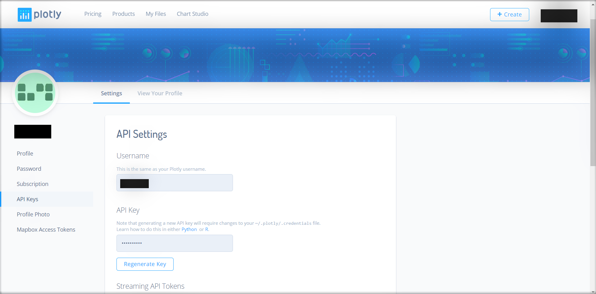
   
  * Note: If you are using a free version of Plotly, you are only allowed 25 plots in your account at a given instance. Hence, before             running this code, please ensure that you have enough number of allowed plots. 
   
   * Install Quandl package through command prompt using
   ```
   pip install quandl
   ```
   * Install alpha vantage package through command prompt using
   ```
   pip install alpha_vantage
   ```
   * Install Plotly package through command prompt using
   ```
   pip install plotly
   ```
    
## Stage 1 Code
 ### Step 1
Insert the username and API key in the fields 'YOUR_PLOTLY_USERNAME' and 'YOUR_PLOTLY_API_KEY' respectively shown below for accessing plotly.
```
tls.set_credentials_file(username = 'YOUR_PLOTLY_USERNAME', api_key = 'YOUR_PLOTLY_API_KEY')
```
Replace your claimed Alpha Vantage API Key with 'YOUR_ALPHA_VANTAGE_KEY' 

```
alpha_key = 'YOUR_ALPHA_VANTAGE_KEY'
```
Replace the field 'YOUR_QUANDL_API_KEY' with your claimed API key from Quandl.

```
quandl_key = 'YOUR_QUANDL_API_KEY'
quandl.ApiConfig.api_key = quandl_key
quotes = quandl.get("CHRIS/CME_CL1", returns = 'pandas')
```
### Step 2
Run the python script.

### Step 3
6 different windows of Plotly graphs will pop-up in the users default browser. ( By inserting the claimed username and API Key of Plotly) 

## Stage 2 Code
 ### Step 1
Replace 'YOUR_PLOTLY_USERNAME' and 'YOUR_PLOTLY_API_KEY' with your claimed username and key respectively. 
```
    tls.set_credentials_file(username = 'YOUR_PLOTLY_USERNAME', api_key = 'YOUR_PLOTLY_API_KEY')
```

Fetching time series data in pandas data-frame format from Alpha Vantage API. Replace your Alpha Vantage key with 'YOUR_ALPHA_VANTAGE_API_KEY'. The latest value of Stock i.e current day stock price can be accessed from pandas data-frame with first column as shown below. 
```
    ts = TimeSeries(key='YOUR_ALPHA_VANTAGE_API_KEY', output_format = 'pandas')
```
### Step 2
Run the code

### Step 3
A prompt will be generated for the user to enter 3 different inputs.
The first input prompt for the user will be:
Enter the desired Stock Ticker Symbol and press the Enter button. 
```
Enter Stock Ticker: 
```
### Step 4
Enter the number of stocks of the desired stock that the user intends to buy
```
Enter number of stocks to buy:
```
### Step 5
Enter the number of days in the future after which the user desires the forecasted stock price.
```
Enter the number of days after which you want the forecast:
```
After completing all the 5 Steps for the Stage 2 code, following outputs will be generated:-
1. Intuitive graphs on the PLotly platform generated in two separate tabs of users default web-browser.
2. Diagnostic results depicted using graphs on the Console(for Spyder)
3. Current day stock price(If the code is run on a weekend, the closing price on the Friday prior to that weekend will be displayed)
4. The Mean Squared Error value of the forecast on the Console(for Spyder)
5. Numeric value of user's intended investment(in USD)
6. Numeric value Return on investment on the desired date entered by the user(in USD)
7. Hold/Buy or Hold/Sell Strategy recommendation 
8. Numeric value of the predicted profit or loss for the users investment

# Data Sources

The following sources for real-time data has been used for this project:-
* 'Time Series Daily' from the Stock Time Series Data from Alpha Vantage API
   https://www.alphavantage.co/documentation/ 

* 'Closing Price' of crude oil from Quandl API

   https://www.quandl.com/collections/futures/cme-wti-crude-oil-futures


# Explanation of the Code
Project has been divided into two different stages. 

* Stage 1 : To check whether commodity prices affect the commodity based company stocks.
* Stage 2 : Stock forecasting using ARIMA model with Real-time and Historical Data.

### Code description for Stage 1

The code for implementing Stage 1 beings with the importing of necessary libraries such as Quandl, Time Series, Plotly and other such libraries given below.
```
from alpha_vantage.timeseries import TimeSeries
from pprint import pprint
import quandl
import numpy as np
from sklearn import linear_model
import matplotlib.pyplot as plt
from sklearn.metrics import mean_squared_error
from sklearn.utils.validation import column_or_1d
import sklearn
import math
import plotly.plotly as py
import plotly.tools as tls
import plotly.graph_objs as go
```

Insert the username and API key in the fields 'YOUR_PLOTLY_USERNAME' and 'YOUR_PLOTLY_API_KEY' respectively shown below for accessing plotly.
```
tls.set_credentials_file(username = 'YOUR_PLOTLY_USERNAME', api_key = 'YOUR_PLOTLY_API_KEY')

alpha_key = 'YOUR_ALPHA_VANTAGE_KEY'
```

Fetching the stock prices for Oil Companies using Alpha Vantage API. Replace YOUR_ALPHA_VANTAGE_API_KEY with your personal Alpha Vantage API key. (Steps on claiming the API key from Alpha Vantage have been provided below in the section- 'How to run the code?' of this document.)
Below is the code for fetching the Time series data in Pandas Data-frame format under the variable 'ts' for Exxon Mobil Corporation by using the ticker symbol 'XOM'. A detailed list of the Energy Stocks and their corresponding ticker symbols can be found from the link - https://en.wikipedia.org/wiki/List_of_largest_energy_companies

```
ts = TimeSeries(key= alpha_key, output_format = 'pandas')
data_XOM, meta_data = ts.get_daily(symbol='XOM', outputsize='full')
```
Similar process has been repeated for fetching data from four other companies such as Chevron Corporation (CVX), Occidental Petroleum (OXY), National Oilwell Varco (NOV) and Halliburton Company (HAL).
```
ts = TimeSeries(key=alpha_key, output_format = 'pandas')
data_CVX, meta_data = ts.get_daily(symbol='CVX', outputsize='full')
```

```
ts = TimeSeries(key=alpha_key, output_format = 'pandas')
data_OXY, meta_data = ts.get_daily(symbol='OXY', outputsize='full')
```

```
ts = TimeSeries(key=alpha_key, output_format = 'pandas')
data_NOV, meta_data = ts.get_daily(symbol='NOV', outputsize='full')
```

```
ts = TimeSeries(key=alpha_key, output_format = 'pandas')
data_HAL, meta_data = ts.get_daily(symbol='HAL', outputsize='full')
``` 

Fetch current crude oil prices from Quandl API. Replace the field 'YOUR_QUANDL_API_KEY' with your claimed API key from Quandl. (Steps to claim an API Key from Quandl can be found in the 'How to run the code?' section of the document.)

```
quandl_key = 'YOUR_QUANDL_API_KEY'
quandl.ApiConfig.api_key = quandl_key
quotes = quandl.get("CHRIS/CME_CL1", returns = 'pandas')
 ```
Taking a subset of the obtained pandas data-frame for the above mentioned five companies. The subset of the data consists of the historical data from the previous 300 days.
 ```
oil = quotes.iloc[-300:,3]
XOM = data_XOM.iloc[-300:,1]
CVX = data_CVX.iloc[-300:,1]
OXY = data_OXY.iloc[-300:,1]
NOV = data_NOV.iloc[-300:,1]
HAL = data_HAL.iloc[-300:,1]
```
Index of the dataset have been reduced to day, month and year using the following line of code.
```
oil.index =oil.index.map(lambda t: t.strftime('%Y-%m-%d'))
```

Creating empty lists as an input to the Lasso Regression model implemented in the later part of the Stage 1 code. (Documentation for Lasso Regression can be found at the end of this document.) 
```
data_oil = []
data_XOM = []
data_CVX = []
data_OXY = []
data_NOV = []
data_HAL = []
lag_oil = []
lag_XOM = []
lag_CVX = []
lag_OXY = []
lag_NOV = []
lag_HAL = []
rms_oil = []
rms_lag = []
```
Appending stock prices data in the form of 'list within a list'.
```
for i in range(0, len(oil)):
    data_oil.append([oil[i]])
    data_XOM.append([XOM[i]])
    data_CVX.append([CVX[i]])
    data_OXY.append([OXY[i]])
    data_NOV.append([NOV[i]])
    data_HAL.append([HAL[i]])
```
Appending stock prices of previous day in a 'list within a list'.
```
for i in range(1, len(oil)):
    lag_oil.append([oil[i]])
    lag_XOM.append([XOM[i]])
    lag_CVX.append([CVX[i]])
    lag_OXY.append([OXY[i]])
    lag_NOV.append([NOV[i]])
    lag_HAL.append([HAL[i]])
```
Initializaing the implementation of Lasso Regression Model. The data has been split into training and test sets for machine learning purposes. Importing the train_test_split module form the sklearn.cross_validation libarary as shown below.
```
from sklearn.cross_validation import train_test_split
train_oil, test_oil = train_test_split(data_oil, test_size=0.2, random_state=0)
train_lag_oil, test_lag_oil = train_test_split(lag_oil, test_size=0.2, random_state=0)
train_XOM, test_XOM = train_test_split(data_XOM, test_size=0.2, random_state=0)
train_lag_XOM, test_lag_XOM = train_test_split(lag_XOM, test_size=0.2, random_state=0)
```

Using the Lasso regression module with a pre-specified alpha value of 0.01 and a tolerance value of 0.00001. Lasso regression is implemented for the Exxon Mobil stock. In addition to this, implementation of Lasso regression for crude oil price versus current stock price of exxon mobil is shown below. A predicted value based on previous comparisons is obtained with the use of this regression model. 

```
Lasso_XOM = linear_model.Lasso(alpha = 0.01, tol = 0.00001)
Lasso_XOM.fit(train_oil,train_XOM)
XOM_pred_oil = Lasso_XOM.predict(test_oil)
```
Now, computing the Root Mean Squared error as shown below.
```
rms_oil.append(math.sqrt(mean_squared_error(test_XOM, XOM_pred_oil)))
```
Run Lasso regression for stock price versus previous day price
```
train_XOM = train_XOM[:-1]
Lasso_XOM.fit(train_lag_XOM,train_XOM)
XOM_pred_prev = Lasso_XOM.predict(test_lag_XOM)
```

```
rms_lag.append(math.sqrt(mean_squared_error(test_XOM, XOM_pred_prev)))
```

```
p1 = go.Scatter(x=oil.index[-60:], y = XOM_pred_oil, name='stock prediction from oil prices', line=dict(width=2))
p2 = go.Scatter(x=oil.index[-60:], y = XOM_pred_prev, name='stock prediction from previous day prices', line=dict(width=2))
p3 = go.Scatter(x=oil.index[-60:], y = test_XOM, name='Actual stock price', line=dict(width=2))
p = [p1,p2,p3]
layout = dict(title='Exxon Mobil Corporation', xaxis = dict(title = 'Days'), yaxis = dict(title = 'Stock price'))
fig_XOM = dict(data = p, layout = layout)
```

Plotting the above algorithm for prediction results of XOM stock as shown below. 
```
py.plot(fig_XOM, filename = 'XOM')
```

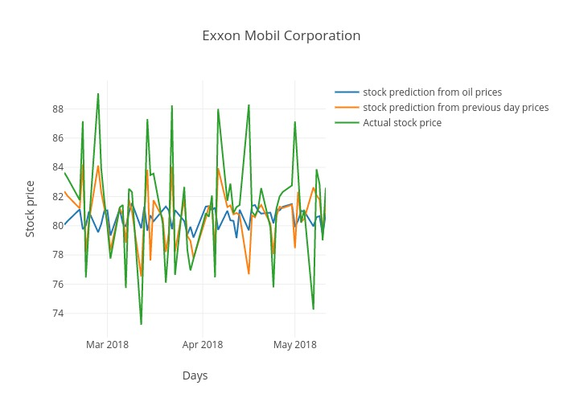

In the plot shown above, the 'Blue' trend line shows the stock prediction from the oil prices, 'Orange' trend line shows the prediction using previous day prices(Historical stock) and the green line shows the actual stock prices fetched from API. 
We can infer that the best predictor for future stock price is the stock price itself.
Similarly, we have generated plots for four different companies such as Chevron (CVX), Occidental Petroleum (OXY), National Oilwell Varco(NOV) and Halliburton Company(HAL).

We can validate this observation based on other stock companies as well.
```
train_CVX, test_CVX = train_test_split(data_CVX, test_size=0.2, random_state=0)
train_lag_CVX, test_lag_CVX = train_test_split(lag_CVX, test_size=0.2, random_state=0)

Lasso_CVX = linear_model.Lasso(alpha = 0.01, tol = 0.00001)

Lasso_CVX.fit(train_oil,train_CVX)
CVX_pred_oil = Lasso_CVX.predict(test_oil)
rms_oil.append(math.sqrt(mean_squared_error(test_CVX, CVX_pred_oil)))

train_CVX = train_CVX[:-1]
Lasso_CVX.fit(train_lag_CVX,train_CVX)
CVX_pred_prev = Lasso_CVX.predict(test_lag_CVX)

rms_lag.append(math.sqrt(mean_squared_error(test_CVX, CVX_pred_prev)))

p1 = go.Scatter(x=oil.index[-60:], y = CVX_pred_oil, name='stock prediction from oil prices', line=dict(width=2))
p2 = go.Scatter(x=oil.index[-60:], y = CVX_pred_prev, name='stock prediction from previous day prices', line=dict(width=2))
p3 = go.Scatter(x=oil.index[-60:], y = test_CVX, name='Actual stock price', line=dict(width=2))
p = [p1,p2,p3]
layout = dict(title='Chevron Corporation', xaxis = dict(title = 'Days'), yaxis = dict(title = 'Stock price'))
fig_CVX = dict(data = p, layout = layout)
py.plot(fig_CVX, filename = 'CVX')

```
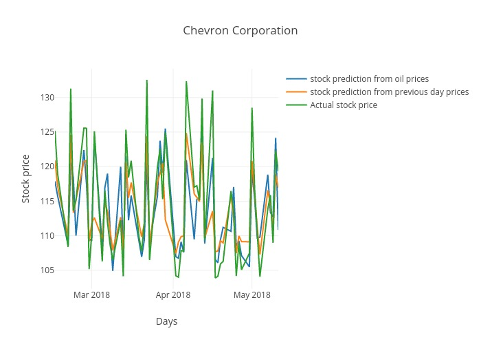
```
train_OXY, test_OXY = train_test_split(data_OXY, test_size=0.2, random_state=0)
train_lag_OXY, test_lag_OXY = train_test_split(lag_OXY, test_size=0.2, random_state=0)


Lasso_OXY = linear_model.Lasso(alpha = 0.01, tol = 0.00001)
Lasso_OXY.fit(train_oil,train_OXY)
OXY_pred_oil = Lasso_OXY.predict(test_oil)

rms_oil.append(math.sqrt(mean_squared_error(test_OXY, OXY_pred_oil)))

train_OXY = train_OXY[:-1]
Lasso_OXY.fit(train_lag_OXY,train_OXY)
OXY_pred_prev = Lasso_OXY.predict(test_lag_OXY)

rms_lag.append(math.sqrt(mean_squared_error(test_OXY, OXY_pred_prev)))

p1 = go.Scatter(x=oil.index[-60:], y = OXY_pred_oil, name='stock prediction from oil prices', line=dict(width=2))
p2 = go.Scatter(x=oil.index[-60:], y = OXY_pred_prev, name='stock prediction from previous day prices', line=dict(width=2))
p3 = go.Scatter(x=oil.index[-60:], y = test_OXY, name='Actual stock price', line=dict(width=2))
p = [p1,p2,p3]
layout = dict(title='Oxydental Petroleum', xaxis = dict(title = 'Days'), yaxis = dict(title = 'Stock price'))
fig_OXY = dict(data = p, layout = layout)
py.plot(fig_OXY, filename = 'OXY')
```
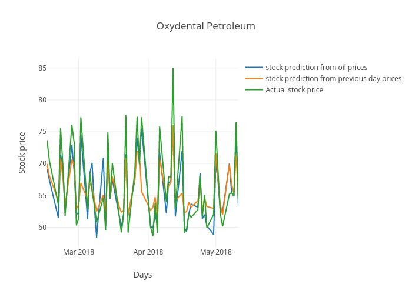
```

train_NOV, test_NOV = train_test_split(data_NOV, test_size=0.2, random_state=0)
train_lag_NOV, test_lag_NOV = train_test_split(lag_NOV, test_size=0.2, random_state=0)


Lasso_NOV = linear_model.Lasso(alpha = 0.01, tol = 0.00001)

Lasso_NOV.fit(train_oil,train_NOV)
NOV_pred_oil = Lasso_NOV.predict(test_oil)


rms_oil.append(math.sqrt(mean_squared_error(test_NOV, NOV_pred_oil)))

train_NOV = train_NOV[:-1]
Lasso_NOV.fit(train_lag_NOV,train_NOV)
NOV_pred_prev = Lasso_NOV.predict(test_lag_NOV)

rms_lag.append(math.sqrt(mean_squared_error(test_NOV, NOV_pred_prev)))

p1 = go.Scatter(x=oil.index[-60:], y = NOV_pred_oil, name='stock prediction from oil prices', line=dict(width=2))
p2 = go.Scatter(x=oil.index[-60:], y = NOV_pred_prev, name='stock prediction from previous day prices', line=dict(width=2))
p3 = go.Scatter(x=oil.index[-60:], y = test_NOV, name='Actual stock price', line=dict(width=2))
p = [p1,p2,p3]
layout = dict(title='National Oilwell Varco', xaxis = dict(title = 'Days'), yaxis = dict(title = 'Stock price'))
fig_NOV = dict(data = p, layout = layout)
py.plot(fig_NOV, filename = 'NOV')
```
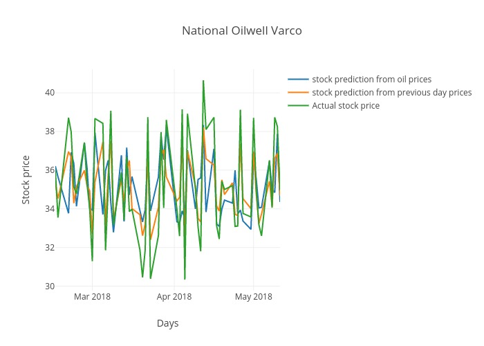
```

train_HAL, test_HAL = train_test_split(data_HAL, test_size=0.2, random_state=0)
train_lag_HAL, test_lag_HAL = train_test_split(lag_HAL, test_size=0.2, random_state=0)

Lasso_HAL = linear_model.Lasso(alpha = 0.01, tol = 0.00001)
Lasso_HAL.fit(train_oil,train_HAL)
HAL_pred_oil = Lasso_HAL.predict(test_oil)

rms_oil.append(math.sqrt(mean_squared_error(test_HAL, HAL_pred_oil)))

train_HAL = train_HAL[:-1]
Lasso_HAL.fit(train_lag_HAL,train_HAL)
HAL_pred_prev = Lasso_HAL.predict(test_lag_HAL)


rms_lag.append(math.sqrt(mean_squared_error(test_HAL, HAL_pred_prev)))

p1 = go.Scatter(x=oil.index[-60:], y = HAL_pred_oil, name='stock prediction from oil prices', line=dict(width=2))
p2 = go.Scatter(x=oil.index[-60:], y = HAL_pred_prev, name='stock prediction from previous day prices', line=dict(width=2))
p3 = go.Scatter(x=oil.index[-60:], y = test_HAL, name='Actual stock price', line=dict(width=2))
p = [p1,p2,p3]
layout = dict(title='Halliburton Company', xaxis = dict(title = 'Days'), yaxis = dict(title = 'Stock price'))
fig_HAL = dict(data = p, layout = layout)
py.plot(fig_HAL, filename = 'HAL')
```
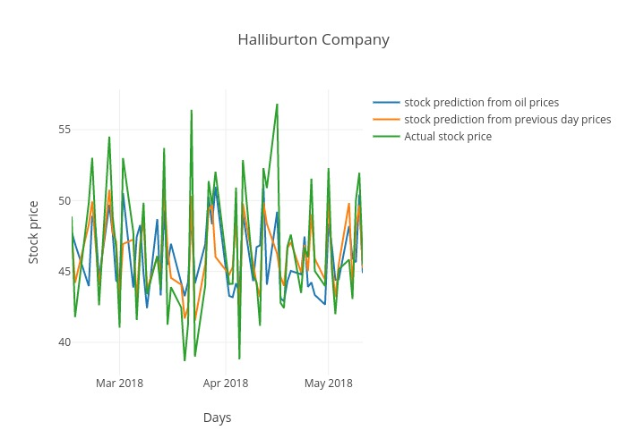
```

names = ['Exxon Mobil Corporation', 'Chevron Corporation', 'Occidental Petroleum', 'National Oilwell Varco', 
         'Halliburton Company']

mean_oil = np.mean(rms_oil)
mean_lag = np.mean(rms_lag)
trace1 = go.Bar(x = names, y = rms_oil, name = 'RMS error for oil')
trace2 = go.Bar(x = names, y = rms_lag, name = 'RMS error for previous day')
b = [trace1, trace2]
layout = go.Layout(barmode = 'group')
fig_bar = go.Figure(data=b, layout = layout)
py.plot(fig_bar, filename = 'RMS Error')

```
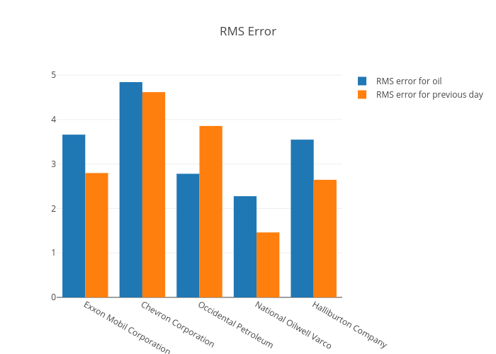

From the above plot, we can infer that the RMS error for prediction using oil prices is more as compared to the RMS error for prediction using previous day stock prices. However, there is one outlier in this case for stock company 'Occidental Petroleum'.

### Code description for Stage 2

This code is dedicated to the forecasting of stock prices using the ARIMA (Auto Regressive Integrated Moving Average) model.
Defining the 'forecast' function by taking arguments such as stock_ticker, n_stock and n_days. Here, stock_ticker is the Stock Ticker Symbol defined as a string variable, n_stock is referred to the number of stocks to buy and n_days is defined as the number of days for forecasts.
Also, importing necessary libraries such as numpy, pandas and other such libraries in the body of the function. 
```
def forecast(stock_ticker, n_stock, n_days):
    from alpha_vantage.timeseries import TimeSeries
    import warnings
    import itertools
    import pandas as pd
    import numpy as np
    import statsmodels.api as sm
    import matplotlib.pyplot as plt
    import plotly.plotly as py
    import plotly.tools as tls
    import plotly.graph_objs as go
```

Initiating the plot creation using Plotly by defining the personal credentials such as username and api_key. Replace 'YOUR_PLOTLY_USERNAME' and 'YOUR_PLOTLY_API_KEY' with your claimed username and key respectively. 

```
    tls.set_credentials_file(username = 'YOUR_PLOTLY_USERNAME', api_key = 'YOUR_PLOTLY_API_KEY')
```

Fetching time series data in pandas data-frame format from Alpha Vantage API. Replace your Alpha Vantage key with 'YOUR_ALPHA_VANTAGE_API_KEY'. The latest value of Stock i.e current day stock price can be accessed from pandas data-frame with first column as shown below. 
```
    ts = TimeSeries(key='YOUR_ALPHA_VANTAGE_API_KEY', output_format = 'pandas')
    data, meta_data = ts.get_daily(symbol=stock_ticker, outputsize='full')
    current_price = data.iloc[:,1][-1]
    investment = n_stock * current_price

    data = data.iloc[:,1]
    data = data.fillna(data.bfill())
```
   
The below chunk of code is commented out because during runtime it takes a lot of computational power to run this part (10-15 minutes). The values used in the model are hardcoded in this case i.e. (1,1,1) and (1,1,1,12), and these values are found by the code shown below. 
   
     p = d = q = range(0, 2)
    
     
    pdq = list(itertools.product(p, d, q))
    
  
    
    seasonal_pdq = [(x[0], x[1], x[2], 12) for x in list(itertools.product(p, d, q))]
    
    
    
    #print('Examples of parameter combinations for Seasonal ARIMA...')
    #print('SARIMAX: {} x {}'.format(pdq[1], seasonal_pdq[1]))
    #print('SARIMAX: {} x {}'.format(pdq[1], seasonal_pdq[2]))
    #print('SARIMAX: {} x {}'.format(pdq[2], seasonal_pdq[3]))
    #print('SARIMAX: {} x {}'.format(pdq[2], seasonal_pdq[4]))
    #count = 1000000
    #warnings.filterwarnings("ignore") # specify to ignore warning messages
    #for param in pdq:
    #    for param_seasonal in seasonal_pdq:
    #       try:
    #            mod = sm.tsa.statespace.SARIMAX(data,
    #                                           order=param,
    #                                            seasonal_order=param_seasonal,
    #                                           enforce_stationarity=False,
    #                                            enforce_invertibility=False)
    #            
    #            results = mod.fit()
    #            if results.aic < count:
    #                order1 = param
    #                order2 = param_seasonal
    #                count = results.aic
    #                print('ARIMA{}x{}12 - AIC:{}'.format(param, param_seasonal, results.aic))
    #        except:
    #            continue
                
      
Now fitting the ARIMA model and plotting the diagnostic plots.

   
    mod = sm.tsa.statespace.SARIMAX(data,
                                    order= (1,1,1),
                                    seasonal_order= (1,1,1,12),
                                    enforce_stationarity=False,
                                    enforce_invertibility=False)
    
    results = mod.fit()

    #print(results.summary().tables[1])   
    
    plot = results.plot_diagnostics(figsize=(15, 12))
    
    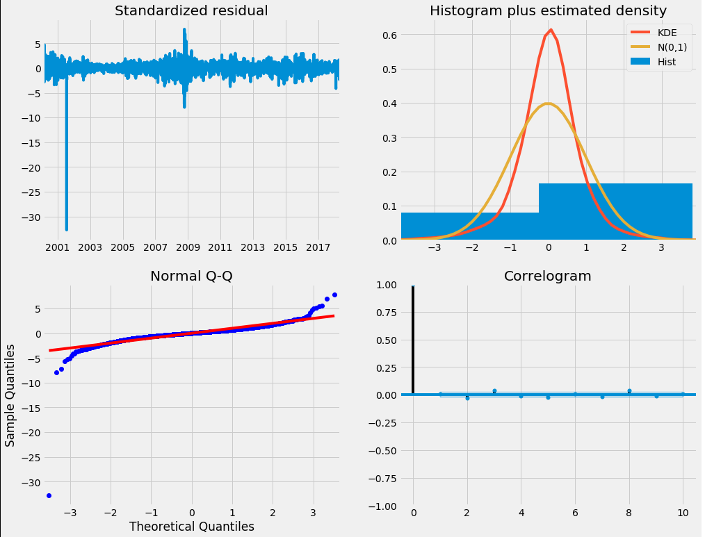

The used ARIMA Model can be categorized and validated by four different statistical graphs. From the graphs displayed above, it can be inferred that the model used has a good normal distribution. This validation is necessary to make any possible changes to the existing ARIMA model.
    
  Now saving the obtained validation graph in pdf format in the working directory.
    ```
    plot.savefig('validation.pdf')     
    ```
    
  ```
    pred = results.get_prediction(start=pd.to_datetime(data.index[len(data)/2]), dynamic=False)
    pred_ci = pred.conf_int()      
    
 
    pred_ci.index =pred_ci.index.map(lambda t: t.strftime('%Y-%m-%d'))
    prediction = np.array(pred_ci)
    pred_ci['avg'] = pred_ci.mean(axis = 1)
 ```
 Now using Plotly to plot the Time-Series data
 ```
    timeseries1 = go.Scatter(x = data.index, y = data, name = 'Actual stock price')
    timeseries2 = go.Scatter(x = pred_ci.index, y = pred_ci['avg'], name = 'Test stock price')
    timeseries = [timeseries1, timeseries2]
    layout = dict(title = "Train test plot", xaxis = dict(range = [data.index[0], data.index[len(data)-1]]))
    fig_ts1 = dict(data = timeseries, layout = layout)
    py.plot(fig_ts1, filename = 'timeseres1')
```
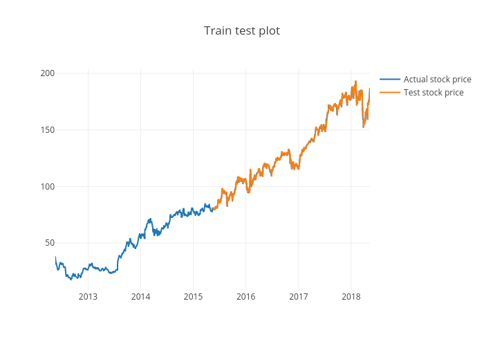

It can be observed that the tested data follows the trend for the original stock prices. This is a validation technique to ensure that the data used for testing follows the trend for the original stocks as closely as possible.

    
   Now, Computing the mean square error as explained below.
```    
    mse = ((pred_ci['avg'] - data[len(pred_ci):]) ** 2).mean()
    print "\n"
    print "Result:"
    print "\n"
    print('The Mean Squared Error of our forecasts is {}'.format(round(mse, 2)))

 ```

   Predicting the results based on the inputs i.e. n_days. 
```
    rng = pd.date_range(data.index[-2], periods=n_days+3, freq='D')
    rng = rng.map(lambda t: t.strftime('%Y-%m-%d'))
    rng = pd.DataFrame(rng)
    index = pd.DataFrame(data.index[:-2])
    index.columns = [0]
    dateindex1 = [index, rng]
    dataindex = pd.concat(dateindex1)
    dataindex.index = dataindex
    

    pred_uc = results.get_prediction(end = len(data)+n_days)
 ```
   Get confidence intervals of forecasts
 ```
    pred_uc = pred_uc.conf_int()
    pred_uc['avg'] = pred_uc.mean(axis = 1)
    timeseries3 = go.Scatter(x = dataindex.index, y = pred_uc.iloc[14:,0], name = 'Low')
    timeseries4 = go.Scatter(x = dataindex.index, y = pred_uc.iloc[14:,1], name = 'High')
    timeseries5 = [timeseries3, timeseries4]
    py.plot(timeseries5)
```


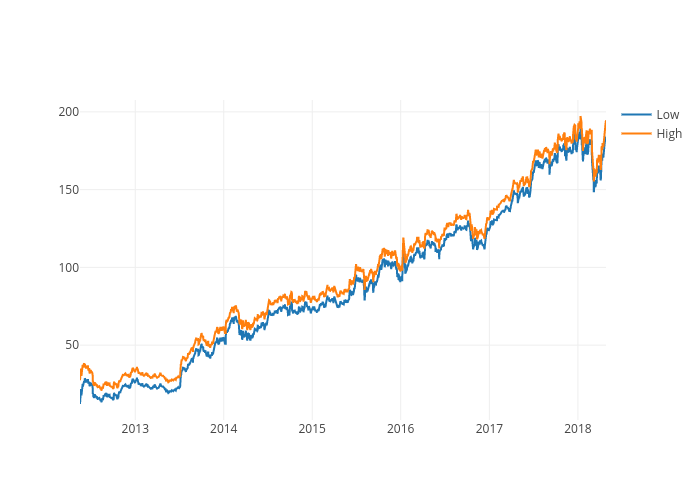

The trend for the original stock price data is compared with the forecasted stock prices of the ARIMA model. 

Hold, Buy or Sell Strategy is implemented by computing the Return of Investment. A positive difference between the Return on Investment and the Original Investment will result in a 'Hold or Sell' suggestion. Additionally, the cumulative Profit will be displayed to facilitate the User's decision making process. Whereas, a negative difference between the Return on Investment and the Original Investment will result in a 'Hold or Buy' suggestion for the user. In this case, the Loss is computed and displayed for the user.  
```
    forecasted_stock_price = pred_uc.iloc[:,2][len(pred_uc)-1]
    roi = n_stock * forecasted_stock_price
    strategy = roi - investment
    print "Current investment = $%f" %investment
    print "Return on investment on %s = $%f" %(dataindex[0][-2],roi)
    if (strategy >= 0):
        print "Recommended Strategy:"
        print "Hold or sell"
        print "Profit =",strategy
    if (strategy < 0):
        print "Recommended Strategy:"
        print "Hold or buy"
        print "Loss =",-strategy
```

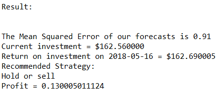

    
The code creates prompt for the user to enter three different inputs during run-time such as Stock Sticker Symbol, Desired number of stocks to be purchased, desired days of forecast.

```
stock_ticker = raw_input("Enter Stock ticker: \n")
n_stock = int(raw_input("Enter number of stocks to buy: \n"))
n_days = int(raw_input("Enter the number of days after which you want the forecast: \n"))
forecast(stock_ticker, n_stock, n_days)
```

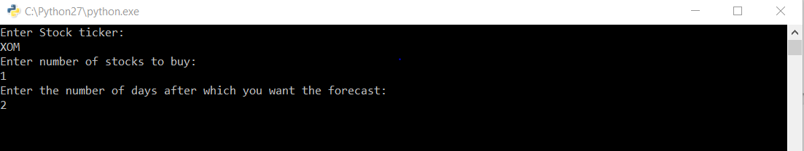


# Inferences

* There is a split decision between Stock Investors on the amount of influence that commodity prices have on commodity-specific companies. For the scope of this project, Oil, as a commodity and the oil-based companies such as Exxon Mobil(XOM), Chevron (CVX), Occidental Petroleum (OXY), National Oilwell Varco(NOV) and Halliburton Company(HAL) was taken into consideration.

* After comparing the influence of Oil prices and previous day stock prices of the same stock, we can infer that, the previous day stock prices of the same stocks can be better predictors for future Stock prices.

* Implementing the ARIMA forecasting model, a recommendation system was created by deploying user inputs for Stock Tick Symbol, Number of Stocks and desired days in the future for stock price prediction. By computing the forecasted value of the desired stock and computing the intended user investment based on given number of stocks, the code can recommend a strategy and a numeric value for the profit/loss to the user by comparing the predicted stock price and current stock price.


 # Limitations

* Since the free version of Plotly is used here, one cannot have more than 25 plots in Plotly account and you might have to clear the previously obtained plots in order to proceed further.

* Use only those stock tickers that are listed in NYSE.


 


